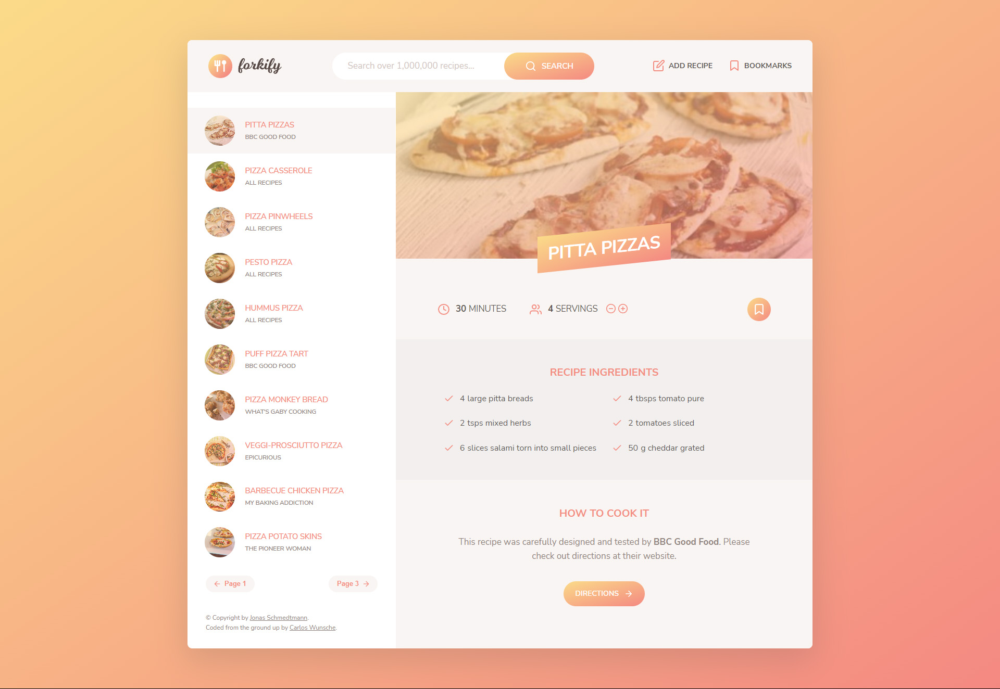

  

 

  
    
    

---

With forkify you can search, personalize, and create your own favourite recipes!

## Features

- Search among 1 million recipes
- Personalize selecting amount of servings
- Get original cooking instructions from source
- Save your favourite recipes with a bookmark feature
- Upload your own custom recipes
- Use of the Forkify web API v2
- Bundling with Parcel

## Live preview

Access the live preview [following this link.](https://cw-forkify.netlify.app)

## Screenshot

## Credits

- Coded from the ground up by Carlos Wunsche.

- Copyright &copy; Jonas Schmedtmann.
